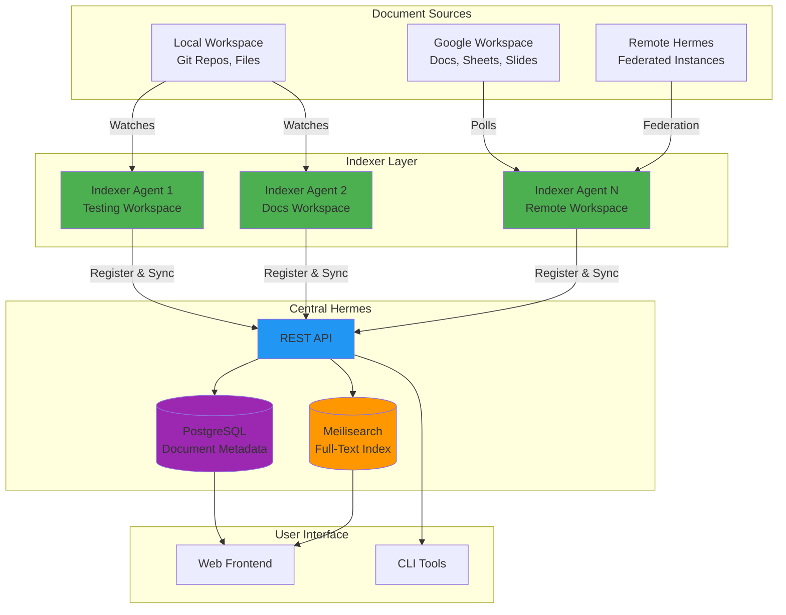

# RFC: Indexer Architecture and Distributed Document Management

**Status**: Implemented (Phase 1 Complete)  
**RFC Number**: TBD  
**Created**: October 26, 2025  
**Author**: Hermes Core Team

## Overview

The **Indexer** is Hermes' autonomous document discovery and indexing agent that enables distributed, multi-source document management. It operates independently from the main Hermes server, watching workspaces for changes and synchronizing document metadata to a central search index.



## Why the Indexer Exists

### Core Problem

Traditional document management systems assume **single-source, centralized storage**:
- All documents in one database
- Single provider (Google Drive OR local files, not both)
- Tight coupling between storage and search
- Difficult to migrate or federate

### The Solution

The indexer enables **distributed, multi-source document management** by:

1. **Decoupling discovery from storage** - Documents stay where they are (Git, Google Drive, etc.)
2. **Autonomous operation** - Indexers run independently, no central coordination required
3. **Pluggable providers** - Support local files, Google Workspace, remote Hermes instances, etc.
4. **Migration support** - Documents can exist in multiple sources during migration with conflict detection
5. **Scalability** - Multiple indexers can watch different workspaces simultaneously

### Key Design Principle

> **"The indexer discovers and tracks documents; it doesn't own them."**

Documents live in their native storage (Git repos, Google Drive, file systems). The indexer maintains a **lightweight metadata index** in Hermes for search and navigation, but source documents remain authoritative.

## What Indexer Is

### 1. Document Discovery Agent
- **Watches workspaces** for new/modified/deleted documents
- **Polls providers** (Google Drive) or monitors file systems (inotify, polling)
- **Extracts metadata** from frontmatter, headers, or provider APIs
- **Assigns UUIDs** to documents for stable identification across migrations

### 2. Metadata Synchronization Engine
- **Registers** with central Hermes on startup
- **Sends heartbeats** to indicate health
- **Syncs document metadata** to PostgreSQL (title, author, created/modified dates)
- **Updates search index** in Meilisearch with full-text content

### 3. Migration Facilitator
- **Tracks document UUIDs** across multiple providers
- **Detects content divergence** using SHA-256 content hashes
- **Creates revisions** when same document exists in multiple sources
- **Flags conflicts** when content differs during migration

### 4. Provider Adapter
- **Local Provider**: Watches file systems (markdown, text files)
- **Google Provider**: Polls Google Drive API for changes
- **Remote Provider**: Federates with other Hermes instances (future)

## What Indexer Is NOT

### ❌ Not a Storage Backend
The indexer **does not store document content**. Documents remain in their source locations:
- Local files stay in Git repos or file systems
- Google Docs stay in Google Drive
- Content is fetched on-demand from providers, not cached permanently

### ❌ Not a Synchronization Service
The indexer **does not replicate documents** between providers:
- It doesn't copy files from Google Drive to local storage
- It doesn't push local changes back to Google Drive
- It's read-only with respect to source documents (writes only metadata to Hermes)

### ❌ Not a Central Coordinator
Indexers operate **autonomously without coordination**:
- No leader election or distributed consensus
- Each indexer independently watches its assigned workspace
- Central Hermes aggregates results, but indexers don't communicate with each other

### ❌ Not a Real-Time Change Notifier
The indexer uses **polling** (default: 5 minutes):
- Changes appear in search after next poll cycle
- Not suitable for instant document visibility (use API-based publishing for that)
- Optimized for batch discovery, not real-time updates

### ❌ Not a Migration Tool
The indexer **detects** migration scenarios but doesn't perform them:
- It flags documents with same UUID in multiple providers
- It calculates content hashes to detect drift
- **Humans or automation scripts** decide how to resolve conflicts

## Architecture

### Component Design

```
┌─────────────────────────────────────────────────────────────┐
│                      Indexer Agent                          │
├─────────────────────────────────────────────────────────────┤
│  ┌──────────────┐  ┌──────────────┐  ┌──────────────┐      │
│  │ Registration │  │  Heartbeat   │  │  Discovery   │      │
│  │   Service    │  │   Service    │  │   Service    │      │
│  └──────────────┘  └──────────────┘  └──────────────┘      │
│                                                              │
│  ┌──────────────────────────────────────────────────────┐  │
│  │           Provider Adapter Interface                 │  │
│  └──────────────────────────────────────────────────────┘  │
│         │                    │                    │         │
│  ┌──────▼──────┐      ┌──────▼──────┐     ┌──────▼──────┐ │
│  │   Local     │      │   Google    │     │   Remote    │ │
│  │  Workspace  │      │  Workspace  │     │   Hermes    │ │
│  │   Adapter   │      │   Adapter   │     │   Adapter   │ │
│  └─────────────┘      └─────────────┘     └─────────────┘ │
└─────────────────────────────────────────────────────────────┘
         │                      │                      │
         ▼                      ▼                      ▼
┌─────────────────┐  ┌──────────────────┐  ┌─────────────────┐
│   File System   │  │  Google Drive    │  │ Remote Hermes   │
│   (Git Repos)   │  │      API         │  │      API        │
└─────────────────┘  └──────────────────┘  └─────────────────┘
```

### Data Flow

**1. Registration (on startup)**
```
Indexer → POST /api/v2/indexers/register
{
  "name": "docs-indexer",
  "type": "local-workspace",
  "workspace_path": "/app/workspaces/docs",
  "project_id": "docs"
}

Response: 200 OK
{
  "indexer_id": "idx-123abc",
  "registered_at": "2025-10-26T10:00:00Z",
  "heartbeat_interval": 300
}
```

**2. Heartbeat (every 5 minutes)**
```
Indexer → POST /api/v2/indexers/{id}/heartbeat
{
  "status": "healthy",
  "documents_indexed": 42,
  "last_scan_at": "2025-10-26T10:05:00Z"
}

Response: 200 OK
```

**3. Document Discovery (polling cycle)**
```
1. Scan workspace for .md, .txt files
2. Extract frontmatter/metadata
3. Calculate content hash (SHA-256)
4. Check if document exists (by UUID)
   - If new: Create document + revision
   - If exists with same hash: Skip
   - If exists with different hash: Create new revision
5. Sync to Hermes API
6. Update search index
```

**4. Document Synchronization**
```
Indexer → POST /api/v2/documents
{
  "uuid": "550e8400-e29b-41d4-a716-446655440000",
  "title": "RFC-001: API Gateway",
  "project_id": "rfcs",
  "provider_type": "local",
  "provider_document_id": "docs/rfcs/RFC-001.md",
  "content_hash": "sha256:abc123...",
  "metadata": {
    "authors": ["user@example.com"],
    "created": "2025-10-01T10:00:00Z",
    "modified": "2025-10-15T14:30:00Z",
    "status": "draft"
  }
}

Response: 201 Created (new document)
Response: 200 OK (updated document)
Response: 409 Conflict (hash mismatch - migration detected)
```

### Database Schema

```sql
-- Documents identified by stable UUID
CREATE TABLE documents (
    id SERIAL PRIMARY KEY,
    document_uuid UUID UNIQUE NOT NULL,
    title VARCHAR(500),
    created_at TIMESTAMP DEFAULT NOW(),
    updated_at TIMESTAMP DEFAULT NOW()
);

-- Document revisions (provider-project-document-revision)
CREATE TABLE document_revisions (
    id SERIAL PRIMARY KEY,
    document_uuid UUID NOT NULL REFERENCES documents(document_uuid),
    project_id VARCHAR(64) NOT NULL,
    provider_type VARCHAR(50) NOT NULL,
    provider_document_id VARCHAR(500) NOT NULL,
    content_hash VARCHAR(64) NOT NULL,
    last_modified TIMESTAMP NOT NULL,
    status VARCHAR(50) DEFAULT 'active',
    indexed_at TIMESTAMP,
    created_at TIMESTAMP DEFAULT NOW(),
    
    UNIQUE(document_uuid, project_id, provider_type, provider_document_id)
);

-- Indexer agents
CREATE TABLE indexers (
    id SERIAL PRIMARY KEY,
    indexer_id VARCHAR(255) UNIQUE NOT NULL,
    name VARCHAR(255) NOT NULL,
    type VARCHAR(50) NOT NULL,
    workspace_path VARCHAR(500),
    project_id VARCHAR(64),
    status VARCHAR(50) DEFAULT 'active',
    last_heartbeat_at TIMESTAMP,
    registered_at TIMESTAMP DEFAULT NOW()
);
```

## Workflow and Capabilities

### Single Indexer Workflow

**Scenario**: Developer adds RFC to local workspace

```
1. Developer creates docs/rfcs/RFC-042-distributed-auth.md
   ---
   hermes-uuid: 7a8b9c0d-1e2f-3a4b-5c6d-7e8f9a0b1c2d
   status: draft
   authors: [user@example.com]
   ---

2. Indexer detects new file (next poll cycle, ~5 minutes)
3. Extracts metadata from frontmatter
4. Calculates content hash: sha256:def456...
5. Sends to Hermes API:
   POST /api/v2/documents
   {
     "uuid": "7a8b9c0d-1e2f-3a4b-5c6d-7e8f9a0b1c2d",
     "title": "RFC-042: Distributed Auth",
     "project_id": "rfcs",
     "provider_type": "local",
     "provider_document_id": "docs/rfcs/RFC-042-distributed-auth.md",
     "content_hash": "sha256:def456..."
   }

6. Hermes creates document + revision in DB
7. Hermes updates Meilisearch index
8. Document appears in UI search results
```

### Multi-Indexer Workflow

**Scenario**: Two teams with separate workspaces

```
Indexer 1 (Testing Team)
  Watches: /app/workspaces/testing
  Project: testing
  Documents: TEST-001, TEST-002, TEST-003

Indexer 2 (Docs Team)  
  Watches: /app/workspaces/docs
  Project: docs
  Documents: GUIDE-001, GUIDE-002, API-001

Central Hermes
  Aggregates: TEST-001, TEST-002, TEST-003, GUIDE-001, GUIDE-002, API-001
  Search: Returns results from both projects
  UI: Shows documents from both teams in unified interface
```

**Key Capabilities**:
- ✅ Indexers operate independently (no coordination)
- ✅ Each registers with unique name
- ✅ Heartbeats track health of each indexer
- ✅ Central Hermes aggregates documents from all indexers
- ✅ Search spans all projects
- ✅ No race conditions (UUIDs prevent duplicates)

### Migration Workflow

**Scenario**: Migrating RFCs from Google Docs to Local Workspace

```
Phase 1: Pre-Migration (Single Source)
  Provider: google-workspace
  Document: RFC-001 (Google Doc ID: 1a2b3c4d5e6f7890)
  UUID: 550e8400-e29b-41d4-a716-446655440000
  Content Hash: sha256:abc123...
  Status: canonical

Phase 2: Migration Started (Dual Source)
  # Copy document to local workspace with same UUID
  docs/rfcs/RFC-001.md:
    ---
    hermes-uuid: 550e8400-e29b-41d4-a716-446655440000
    ---
  
  # Indexer detects document with existing UUID
  # Creates second revision:
  Revision 1 (Google):
    Provider: google-workspace
    Provider Doc ID: 1a2b3c4d5e6f7890
    Content Hash: sha256:abc123...
    Status: migrating-from
  
  Revision 2 (Local):
    Provider: local
    Provider Doc ID: docs/rfcs/RFC-001.md
    Content Hash: sha256:abc123...  (same content)
    Status: migrating-to

Phase 3: Conflict Detected (Content Divergence)
  # Google Doc edited during migration
  Revision 1 (Google):
    Content Hash: sha256:xyz789...  (CHANGED!)
    Status: conflict-source
  
  Revision 2 (Local):
    Content Hash: sha256:abc123...  (unchanged)
    Status: conflict-target
  
  # UI flags conflict for manual resolution

Phase 4: Migration Complete
  # Google Doc archived or deleted
  Revision 1 (Google):
    Status: archived
  
  Revision 2 (Local):
    Status: canonical
```

**Key Capabilities**:
- ✅ Same document can exist in multiple providers (via UUID)
- ✅ Content hash detects divergence
- ✅ Revisions track migration history
- ✅ Conflicts flagged for human review
- ✅ Zero-downtime migration (both sources active during transition)

### Testing Automation

**Current Implementation** (Phase 1 Complete):

```bash
# Seed workspaces with test documents
make seed                    # 10 documents across testing + docs
make seed-migration          # Migration scenario with conflicts
make seed-multi-author       # Documents from multiple authors

# Run automated scenarios
make scenario-basic          # Basic E2E: seed → index → search → verify

# Validate results
curl http://localhost:8001/api/v2/documents | jq '.documents[] | {title, project_id}'
curl http://localhost:8001/api/v2/search?q=RFC | jq '.results[] | .title'
```

**Test Capabilities**:
- ✅ Generate documents with proper frontmatter + UUIDs
- ✅ Create realistic content (RFCs, PRDs, Meeting Notes, Docs)
- ✅ Simulate migration with duplicate UUIDs
- ✅ Seed multi-author scenarios with timestamps
- ✅ Automated validation via API
- ✅ E2E workflow: create → index → search → verify

## Future Expansion and Improvements

### Phase 2: Multi-Indexer Support (Planned)

**Goal**: Run multiple indexers simultaneously for different workspaces

**Enhancements**:
- [ ] Docker Compose profiles for multi-indexer setup
- [ ] Indexer coordination testing (verify no race conditions)
- [ ] Third workspace (testing/workspaces/remote)
- [ ] API endpoints for indexer status monitoring
- [ ] Makefile targets: `make multi-indexer-up`, `make scenario-multi-indexer`

**Estimated Effort**: 10-15 hours

### Phase 3: Advanced Migration Scenarios (Planned)

**Goal**: Automated conflict detection and resolution workflows

**Enhancements**:
- [ ] Content hash comparison utilities
- [ ] Migration status tracking API
- [ ] Conflict resolution UI
- [ ] Automated tests for edge cases (3-way conflicts, circular migrations)
- [ ] Database queries for migration analytics

**Estimated Effort**: 17-24 hours

### Phase 4: Performance and Monitoring (Planned)

**Goal**: Production-ready performance and observability

**Enhancements**:
- [ ] Benchmark suite (10/100/1000 document datasets)
- [ ] Indexing throughput metrics
- [ ] Search latency profiling
- [ ] Real-time monitoring dashboard
- [ ] Prometheus/Grafana integration
- [ ] CI/CD integration for regression testing

**Estimated Effort**: 28-39 hours

### Phase 5: Remote Hermes Federation (Future)

**Goal**: Federate with other Hermes instances for enterprise aggregation

**Capabilities**:
- [ ] Remote Hermes provider adapter
- [ ] OIDC/API key authentication
- [ ] Bidirectional document sync (read-only → read-write)
- [ ] Caching layer for remote documents
- [ ] Network partition handling
- [ ] Multi-region deployment support

**Example**:
```hcl
project "internal-docs" {
  title = "Internal Documentation"
  
  provider "remote-hermes" {
    base_url = "https://hermes.internal.example.com"
    auth {
      type = "oidc"
      client_id = env("HERMES_REMOTE_CLIENT_ID")
      client_secret = env("HERMES_REMOTE_CLIENT_SECRET")
    }
    sync_mode = "read-only"  # or "bidirectional"
  }
}
```

**Estimated Effort**: 80-120 hours

### Phase 6: Intelligent Indexing (Future)

**Goal**: Smart content extraction and AI-powered metadata enrichment

**Capabilities**:
- [ ] AI-based tag suggestion (using Ollama)
- [ ] Automatic category classification
- [ ] Related document detection
- [ ] Duplicate document identification
- [ ] Broken link detection
- [ ] Stale document flagging (last modified > 6 months, no views)

**Example**:
```yaml
# Auto-generated metadata
ai_metadata:
  suggested_tags: [authentication, security, migration]
  category: infrastructure
  complexity: intermediate
  related_documents:
    - RFC-015: OAuth Integration
    - PRD-042: SSO Requirements
  duplicate_confidence: 0.0
  staleness_score: 0.2
```

**Estimated Effort**: 60-80 hours

### Phase 7: Advanced Provider Support (Future)

**Goal**: Expand beyond Google Workspace and local files

**Providers**:
- [ ] **Confluence** (Atlassian)
- [ ] **Notion** (API-based)
- [ ] **SharePoint** (Microsoft)
- [ ] **GitHub** (wikis, markdown repos)
- [ ] **GitLab** (wikis, snippet repos)
- [ ] **Dropbox Paper**
- [ ] **Quip**

**Generic Provider Interface**:
```go
type ProviderAdapter interface {
    // Discovery
    ListDocuments(ctx context.Context) ([]Document, error)
    GetDocument(ctx context.Context, id string) (*Document, error)
    GetDocumentContent(ctx context.Context, id string) ([]byte, error)
    
    // Metadata
    GetDocumentMetadata(ctx context.Context, id string) (*Metadata, error)
    CalculateContentHash(ctx context.Context, id string) (string, error)
    
    // Change Detection
    ListChanges(ctx context.Context, since time.Time) ([]Change, error)
    SupportsWebhooks() bool
    RegisterWebhook(ctx context.Context, url string) error
}
```

**Estimated Effort**: 40-60 hours per provider

## Implementation Status

### ✅ Phase 1: Foundation (Complete)
- [x] Document generator library (500+ LOC)
- [x] Workspace seeding scripts (300+ LOC)
- [x] Basic E2E scenario automation (100+ LOC)
- [x] Document templates (RFC, PRD, Meeting Notes)
- [x] Makefile integration (`make seed`, `make scenario-basic`)
- [x] Comprehensive documentation (1500+ LOC)

**Delivered**: October 24, 2025  
**Verification**: All scripts tested and working

### ⏳ Phase 2-7: Planned
**Total Estimated Remaining Effort**: 225-358 hours (6-9 weeks of focused development)

## Design Rationale

### Why Polling Instead of Webhooks?

**Decision**: Use polling (5-minute interval) for file system changes

**Rationale**:
- ✅ **Simplicity**: No webhook infrastructure needed
- ✅ **Reliability**: Works across all environments (containers, VMs, local dev)
- ✅ **Portability**: File system watchers (inotify, fsevents) are platform-specific
- ✅ **Batch Efficiency**: Process multiple changes in one cycle vs. one event per file
- ⚠️ **Tradeoff**: 5-minute delay for changes to appear (acceptable for documentation)

**Future**: Add webhook support for Google Drive, GitHub, Confluence (where APIs provide it)

### Why UUIDs Instead of Google Doc IDs?

**Decision**: Use stable UUIDs as primary document identifiers

**Rationale**:
- ✅ **Provider-agnostic**: UUIDs work for local files, Google Docs, remote Hermes
- ✅ **Migration-friendly**: Same UUID across providers enables tracking
- ✅ **Human-readable**: Can be declared in frontmatter (`hermes-uuid: ...`)
- ✅ **Collision-resistant**: UUID v4 has negligible collision probability
- ⚠️ **Tradeoff**: Requires frontmatter injection for local files (automated by indexer)

**Alternative Rejected**: Using provider IDs (Google Doc IDs, file paths) as primary keys would lock us into specific providers

### Why Content Hashing?

**Decision**: Calculate SHA-256 hash of document content to detect changes

**Rationale**:
- ✅ **Drift Detection**: Detect when same document diverges across providers
- ✅ **Deduplication**: Avoid re-indexing unchanged documents
- ✅ **Migration Validation**: Verify successful migration (same hash = same content)
- ✅ **Conflict Detection**: Different hashes = content divergence = conflict
- ⚠️ **Tradeoff**: Requires reading full document content (can be expensive for large docs)

**Optimization**: Cache content hashes, only recalculate if last_modified timestamp changes

### Why Autonomous Indexers Instead of Central Orchestration?

**Decision**: Indexers operate independently without coordination

**Rationale**:
- ✅ **Scalability**: Add more indexers without changing architecture
- ✅ **Fault Tolerance**: One indexer failure doesn't affect others
- ✅ **Simplicity**: No leader election, no distributed consensus needed
- ✅ **Flexibility**: Different poll intervals, different workspaces, different projects
- ⚠️ **Tradeoff**: Can't guarantee global ordering of events (acceptable for documentation)

**Alternative Rejected**: Centralized job queue would add complexity and single point of failure

## Success Criteria

### Phase 1 (Complete ✅)
- [x] Seed script generates 10+ test documents
- [x] Basic scenario runs end-to-end
- [x] Makefile targets functional
- [x] Documents appear in search
- [x] Documentation comprehensive

### Phase 2 (Planned)
- [ ] Two or more indexers run simultaneously
- [ ] All indexers register successfully
- [ ] Documents from all indexers appear in search
- [ ] No race conditions observed

### Phase 3 (Planned)
- [ ] Migration scenario creates document with same UUID in two projects
- [ ] Content hash divergence detected
- [ ] Conflict marked in database
- [ ] API returns conflict status

### Overall Success
- [ ] All phases complete and tested
- [ ] Performance benchmarks meet targets (>100 docs/sec indexing)
- [ ] Migration workflows documented and validated
- [ ] Production deployment successful

## References

### Documentation
- **Architecture**: `DISTRIBUTED_PROJECTS_ARCHITECTURE.md` - Overall architecture and database schema
- **Identity**: `DISTRIBUTED_PROJECT_IDENTITY.md` - Project and instance identity design
- **Roadmap**: `DISTRIBUTED_PROJECTS_ROADMAP.md` - Implementation roadmap
- **Progress**: `DISTRIBUTED_TESTING_PROGRESS.md` - Phase-by-phase implementation tracking
- **Testing**: `testing/DISTRIBUTED_TESTING_ENHANCEMENTS.md` - Detailed testing design

### Implementation
- **Seed Scripts**: `testing/scripts/seed-workspaces.sh`
- **Document Generators**: `testing/scripts/lib/document-generator.sh`
- **Scenarios**: `testing/scripts/scenario-basic.sh`
- **Templates**: `testing/fixtures/rfcs/RFC-TEMPLATE.md`, `testing/fixtures/prds/PRD-TEMPLATE.md`

### Configuration
- **Projects**: `testing/projects.hcl` - Main project configuration
- **Testing Project**: `testing/projects/testing.hcl`
- **Docs Project**: `testing/projects/docs.hcl`

### API Documentation
- **Indexer Registration**: `POST /api/v2/indexers/register`
- **Heartbeat**: `POST /api/v2/indexers/{id}/heartbeat`
- **Document Sync**: `POST /api/v2/documents`
- **Search**: `GET /api/v2/search`

---

**Last Updated**: October 26, 2025  
**Status**: Phase 1 Complete ✅, Phases 2-7 Planned ⏳
