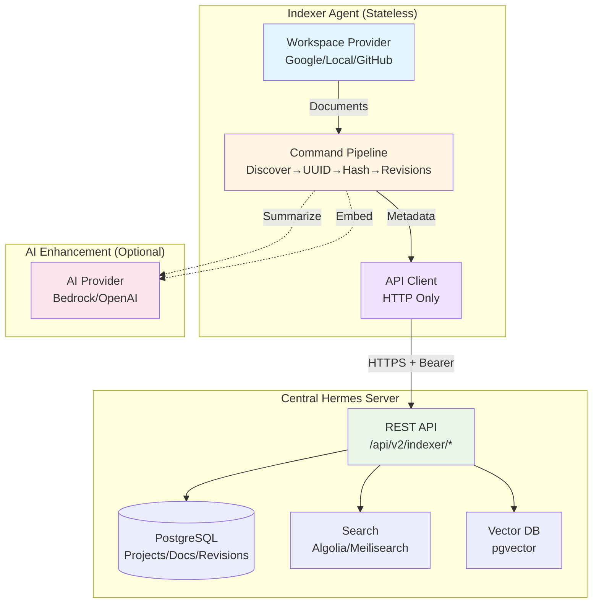

# RFC: Indexer Architecture and Design

**Status**: Complete  
**Created**: October 25, 2025  
**Consolidates**: All INDEXER_* design documents

---

## Overview



---

## Why the Indexer Exists

The Hermes indexer **synchronizes document metadata** from external workspace providers (Google Drive, GitHub, local filesystems) into a centralized database and search index. It enables:

1. **Multi-Provider Document Management**: Work with documents from multiple sources in a unified interface
2. **Full-Text & Semantic Search**: Make documents discoverable through keyword and vector-based search
3. **Revision Tracking**: Monitor document changes across providers during migrations
4. **AI Enhancement**: Optionally enrich documents with AI-generated summaries and embeddings
5. **Distributed Testing**: Support local development workflows without Google Workspace dependencies

The indexer's **stateless design** allows it to run anywhere—developer workstations, CI/CD pipelines, or edge locations—while maintaining a single source of truth in the central Hermes server.

---

## Design Principles

### 1. Stateless Architecture
- **No database dependencies** on indexer side
- All state managed by central Hermes API
- Crash-tolerant (re-registers on restart)
- Horizontally scalable (many indexers → one server)

### 2. Provider Agnostic
- **Workspace providers**: Google Drive, Local FS, GitHub, Remote Hermes
- **Search providers**: Algolia, Meilisearch, pgvector
- **AI providers**: AWS Bedrock, OpenAI, Ollama, Mock

### 3. Command Pipeline Pattern
- **Composable operations**: Chain commands for different workflows
- **Parallel processing**: Process multiple documents concurrently
- **Error isolation**: Failures don't stop entire pipeline
- **Testability**: Mock individual commands

### 4. Project-Based Normalization
- **Single source of truth**: Project config defines provider settings
- **Small database footprint**: Documents reference projects, not duplicate config
- **Easy migrations**: Change project provider, re-index documents
- **Consistent metadata**: All documents in project share provider config

---

## Core Workflow

### Standard Indexing Pipeline

```
[Discover Documents] → [Assign UUID] → [Extract Content] → 
[Calculate Hash] → [Track Revision] → [Transform] → [Index]
```

**Steps**:
1. **Discover**: Scan workspace provider for new/modified documents
2. **Assign UUID**: Generate stable identifiers (stored in frontmatter or database)
3. **Extract Content**: Retrieve document content from provider
4. **Calculate Hash**: SHA-256 hash for change detection
5. **Track Revision**: Record version in `document_revisions` table
6. **Transform**: Convert to search-friendly format
7. **Index**: Submit to search provider (Algolia/Meilisearch)

### AI-Enhanced Pipeline

```
[Standard Pipeline] → [Summarize] → [Generate Embeddings] → 
[Index Vector DB]
```

**Additional Steps**:
- **Summarize**: AI generates executive summary, key points, tags
- **Generate Embeddings**: Create vector representations for semantic search
- **Index Vector DB**: Store embeddings in vector database (pgvector, Meilisearch)

### Migration Pipeline

```
[Discover Source] → [Assign UUID] → [Extract Content] → 
[Calculate Hash] → [Migrate to Target] → [Track Revisions] → 
[Detect Conflicts] → [Index Target]
```

**Use Case**: Move documents from Google Drive to local filesystem for testing.

**Conflict Detection**:
- **Concurrent Edit**: Same document modified in source and target
- **Content Divergence**: Hash mismatch between providers
- **Migration Divergence**: Document exists in both but differs

---

## Database Schema

### Projects Table (Normalization Layer)

```sql
CREATE TABLE projects (
  id SERIAL PRIMARY KEY,
  project_id VARCHAR(255) UNIQUE NOT NULL,  -- "docs-internal"
  short_name VARCHAR(50) NOT NULL,          -- "DOCS"
  description TEXT,
  status VARCHAR(50) DEFAULT 'active',      -- active, archived, migrating
  provider_type VARCHAR(50) NOT NULL,       -- local, github, google, hermes
  provider_config JSONB NOT NULL,           -- Provider settings
  config_hash VARCHAR(64),                  -- Detect config changes
  created_at TIMESTAMP DEFAULT NOW(),
  updated_at TIMESTAMP DEFAULT NOW()
);
```

**Benefits**:
- Projects store provider configuration once
- Documents reference `project_id` instead of duplicating config
- Easy to update provider settings (edit project, re-index)

### Documents Table (Core Metadata)

```sql
CREATE TABLE documents (
  id SERIAL PRIMARY KEY,
  uuid UUID UNIQUE NOT NULL,
  project_id VARCHAR(255) NOT NULL,         -- References projects
  provider_document_id VARCHAR(255) NOT NULL, -- Provider-specific ID
  title VARCHAR(500) NOT NULL,
  doc_type VARCHAR(100),
  doc_number VARCHAR(50),
  status VARCHAR(100),
  indexed_at TIMESTAMP,
  indexer_version VARCHAR(50),
  -- ... other fields
  UNIQUE(project_id, provider_document_id, uuid)
);
```

### Document Revisions Table (Change Tracking)

```sql
CREATE TABLE document_revisions (
  id SERIAL PRIMARY KEY,
  document_id INTEGER NOT NULL REFERENCES documents(id),
  project_id VARCHAR(255) NOT NULL,         -- Which project owns revision
  content_hash VARCHAR(255) NOT NULL,       -- SHA-256
  revision_reference VARCHAR(255),          -- Git commit, version
  commit_sha VARCHAR(255),                  -- For git providers
  summary TEXT,                             -- AI-generated or manual
  modified_by VARCHAR(255),
  modified_at TIMESTAMP,
  metadata JSONB,
  created_at TIMESTAMP DEFAULT NOW(),
  UNIQUE(document_id, project_id, content_hash)
);
```

**Use Case**: Track document versions during migration. Same document UUID can have multiple revisions across different projects.

### Document Embeddings Table (Vector Search)

```sql
CREATE TABLE document_embeddings (
  id SERIAL PRIMARY KEY,
  document_id INTEGER NOT NULL REFERENCES documents(id),
  revision_id INTEGER REFERENCES document_revisions(id),
  model VARCHAR(100) NOT NULL,              -- "text-embedding-3-small"
  model_version VARCHAR(50),
  dimensions INTEGER NOT NULL,              -- 1536, 768, etc.
  embeddings vector(768),                   -- Requires pgvector
  chunk_metadata JSONB,                     -- Chunk info for long docs
  created_at TIMESTAMP DEFAULT NOW()
);
```

---

## API Endpoints

### 1. Register Indexer

```http
POST /api/v2/indexer/register
Authorization: Bearer <registration-token>

{
  "indexer_type": "local-workspace",
  "workspace_path": "/app/workspaces",
  "metadata": {}
}

→ Response:
{
  "indexer_id": "uuid",
  "api_token": "hermes-api-token-xxxxx"
}
```

### 2. Heartbeat

```http
POST /api/v2/indexer/heartbeat
Authorization: Bearer <api-token>

{
  "status": "healthy",
  "last_scan_at": "2025-10-24T22:00:00Z",
  "document_count": 42
}

→ Response: { "acknowledged": true }
```

### 3. Create/Update Document

```http
POST /api/v2/indexer/documents
Authorization: Bearer <api-token>

{
  "uuid": "550e8400-...",
  "project_id": "docs-internal",
  "provider_document_id": "docs/RFC-001.md",
  "title": "RFC-001: Indexer Design",
  "doc_type": "RFC",
  "status": "In Review",
  "owners": ["user@example.com"]
}

→ Response:
{
  "id": "550e8400-...",
  "created": true
}
```

### 4. Create Revision

```http
POST /api/v2/indexer/documents/:uuid/revisions
Authorization: Bearer <api-token>

{
  "project_id": "docs-internal",
  "content_hash": "sha256:abc123...",
  "commit_sha": "def456...",
  "modified_by": "user@example.com",
  "modified_at": "2025-10-24T10:00:00Z"
}

→ Response:
{
  "revision_id": 42,
  "duplicate": false
}
```

### 5. Update AI Summary

```http
PUT /api/v2/indexer/documents/:uuid/summary
Authorization: Bearer <api-token>

{
  "summary": "This RFC proposes...",
  "revision_id": 42,
  "model": "claude-3-7-sonnet",
  "generated_at": "2025-10-24T10:00:00Z"
}
```

### 6. Store Embeddings

```http
PUT /api/v2/indexer/documents/:uuid/embeddings
Authorization: Bearer <api-token>

{
  "revision_id": 42,
  "model": "text-embedding-3-small",
  "dimensions": 1536,
  "embeddings": [[0.1, 0.2, ...]]
}
```

---

## Command Pattern Implementation

### Core Interfaces

```go
// Command operates on a document context
type Command interface {
    Execute(ctx context.Context, doc *DocumentContext) error
    Name() string
}

// BatchCommand optimizes for multiple documents
type BatchCommand interface {
    Command
    ExecuteBatch(ctx context.Context, docs []*DocumentContext) error
}

// Pipeline chains commands
type Pipeline struct {
    Name       string
    Commands   []Command
    Filter     DocumentFilter  // Skip certain documents
    MaxParallel int            // Concurrency limit
}
```

### Document Context (State Carrier)

```go
type DocumentContext struct {
    // Source document
    Document *workspace.Document
    
    // UUID and versioning
    DocumentUUID UUID
    ContentHash  string
    Revision     *models.DocumentRevision
    
    // Hermes metadata
    Metadata     *models.Document
    
    // Processing state
    Content      string
    Transformed  *document.Document
    
    // AI-generated (optional, external structures)
    AISummary    *ai.DocumentSummary
    Embeddings   *ai.DocumentEmbeddings
    VectorDoc    *search.VectorDocument
    
    // Provider info
    SourceProvider workspace.DocumentStorage
    TargetProvider workspace.DocumentStorage
    
    // Migration tracking
    MigrationStatus string
    ConflictInfo    *ConflictInfo
    
    // Errors
    StartTime time.Time
    Errors    []error
}
```

### Example Commands

**Discover Documents**:
```go
type DiscoverCommand struct {
    Provider workspace.DocumentStorage
    FolderID string
    Since    time.Time
}

func (c *DiscoverCommand) Discover(ctx context.Context) ([]*DocumentContext, error) {
    docs, err := c.Provider.ListDocuments(ctx, c.FolderID, &ListOptions{
        ModifiedAfter: &c.Since,
    })
    // Convert to DocumentContext
    return contexts, nil
}
```

**Assign UUID**:
```go
type AssignUUIDCommand struct {
    Provider workspace.DocumentStorage
}

func (c *AssignUUIDCommand) Execute(ctx context.Context, doc *DocumentContext) error {
    // Check document frontmatter for existing UUID
    if uuid := doc.Document.Metadata["uuid"]; uuid != "" {
        doc.DocumentUUID = uuid
        return nil
    }
    
    // Generate new UUID and write back to document
    doc.DocumentUUID = uuid.New()
    return c.Provider.UpdateMetadata(ctx, doc.Document.ID, map[string]string{
        "uuid": doc.DocumentUUID.String(),
    })
}
```

**Calculate Hash**:
```go
type CalculateHashCommand struct{}

func (c *CalculateHashCommand) Execute(ctx context.Context, doc *DocumentContext) error {
    hash := sha256.Sum256([]byte(doc.Content))
    doc.ContentHash = fmt.Sprintf("sha256:%x", hash)
    return nil
}
```

**Track Revision**:
```go
type TrackRevisionCommand struct {
    DB           *gorm.DB
    ProviderType string
}

func (c *TrackRevisionCommand) Execute(ctx context.Context, doc *DocumentContext) error {
    revision := &models.DocumentRevision{
        DocumentID:        doc.Metadata.ID,
        ProjectID:         doc.Document.ProjectID,
        ContentHash:       doc.ContentHash,
        RevisionReference: doc.Document.Version,
        ModifiedBy:        doc.Document.ModifiedBy,
        ModifiedAt:        doc.Document.ModifiedTime,
    }
    return c.DB.Create(revision).Error
}
```

---

## Project Configuration Integration

The indexer resolves workspace providers through **HCL project configuration**:

```hcl
# testing/projects/docs-internal.hcl
project "docs-internal" {
  short_name  = "DOCS"
  description = "Internal documentation"
  status      = "active"
  
  workspace "local" {
    type = "local"
    root = "./docs-internal"
    
    folders {
      docs   = "."
      drafts = ".drafts"
    }
  }
}
```

**CLI Usage**:
```bash
# Index specific project
./hermes indexer -config=config.hcl -project=docs-internal

# Index all active projects
./hermes indexer -config=config.hcl -all-projects

# Dry-run mode (no writes)
./hermes indexer -config=config.hcl -project=docs-internal -dry-run
```

**Benefits**:
- **Single source of truth**: Project config defines workspace provider
- **Easy testing**: Switch between test/prod configs
- **Consistent workflows**: Same CLI for all provider types
- **Migration support**: Change provider in config, re-run indexer

---

## What the Indexer Is NOT

### Not a Content Storage System
The indexer **does not store full document content** in the database. It stores:
- ✅ Metadata (title, status, owners)
- ✅ Revision tracking (content hashes, timestamps)
- ✅ Search indexes (full-text, vector)
- ❌ Raw document content (stays in workspace provider)

**Rationale**: Documents live in their native providers (Google Drive, GitHub). Hermes is a **catalog and search layer**, not a replacement for the source of truth.

### Not a Real-Time Sync Service
The indexer runs on a **schedule** (e.g., every 60 seconds) or **on-demand**. It is not:
- ❌ A real-time webhook listener
- ❌ A filesystem watcher (inotify, fsevents)
- ❌ A Google Drive push notification subscriber

**Rationale**: Polling is simpler, more reliable, and sufficient for document management use cases. Real-time sync adds complexity without proportional value.

### Not a Document Editor
The indexer **reads** documents and **optionally updates metadata** (e.g., UUID in frontmatter), but it:
- ❌ Does not edit document content
- ❌ Does not manage approvals or workflows
- ❌ Does not enforce permissions

**Rationale**: Content editing happens in the workspace provider (Google Docs, VS Code). Hermes focuses on discovery and search.

### Not a Migration Tool (Primary Use Case)
While the indexer **supports migration** (moving documents between providers), this is a **secondary capability**. The primary use case is **continuous indexing** of active documents.

**Rationale**: Migration is a one-time operation. Indexing is ongoing.

---

## Future Enhancements

### 1. Real-Time Indexing via Webhooks
**Status**: Not implemented  
**Priority**: Medium

Add webhook listeners for:
- Google Drive push notifications
- GitHub webhook events
- Filesystem watchers (inotify, fsevents)

**Benefits**: Near-instant indexing of changes without polling overhead.

**Challenges**: Requires webhook endpoint management, retry logic, deduplication.

---

### 2. Incremental Embedding Generation
**Status**: Not implemented  
**Priority**: High

Current approach generates embeddings for entire documents. Improve with:
- **Chunk-level embeddings**: Split long documents into semantic chunks
- **Incremental updates**: Only re-embed changed chunks
- **Hybrid search**: Combine keyword and vector search

**Benefits**: Better semantic search for long documents, reduced AI costs.

---

### 3. Multi-Tenant Indexer Support
**Status**: Not implemented  
**Priority**: Low

Support multiple Hermes instances from one indexer:
```hcl
indexer {
  targets {
    production {
      url   = "https://hermes.company.com"
      token = env("PROD_TOKEN")
    }
    staging {
      url   = "https://hermes-staging.company.com"
      token = env("STAGING_TOKEN")
    }
  }
}
```

**Benefits**: Sync documents to multiple environments (prod, staging, DR).

---

### 4. Custom Document Classifiers
**Status**: Not implemented  
**Priority**: Medium

Use AI to automatically classify documents:
- Detect document type (RFC, PRD, FRD) from content
- Extract doc number from title
- Suggest status based on content maturity
- Recommend tags and categories

**Benefits**: Reduce manual metadata entry, improve consistency.

---

### 5. Conflict Resolution UI
**Status**: Not implemented  
**Priority**: Medium

When migration conflicts occur, provide UI to:
- View side-by-side diff
- Select source or target as canonical
- Merge changes manually
- Mark conflict as resolved

**Benefits**: Handle edge cases in migrations gracefully.

---

### 6. Indexer Health Dashboard
**Status**: Not implemented  
**Priority**: Low

Web UI showing:
- Active indexers and their status
- Last heartbeat time
- Documents processed per indexer
- Error rates and logs
- Indexer version distribution

**Benefits**: Operational visibility for distributed indexer fleet.

---

### 7. Provider-Specific Optimizations
**Status**: Not implemented  
**Priority**: Medium

Optimize for each provider's API characteristics:
- **Google Drive**: Batch API calls, use drive.changes API
- **GitHub**: Use GraphQL API for bulk queries
- **Local FS**: Use filesystem watchers instead of polling

**Benefits**: Reduce API costs, improve performance.

---

### 8. Document Relationship Tracking
**Status**: Not implemented  
**Priority**: Low

Track relationships between documents:
- **References**: Document A links to Document B
- **Dependencies**: RFC depends on PRD
- **Supersedes**: New version replaces old version

**Database Schema**:
```sql
CREATE TABLE document_relationships (
  source_document_id INTEGER NOT NULL,
  target_document_id INTEGER NOT NULL,
  relationship_type VARCHAR(50) NOT NULL,  -- references, depends-on, supersedes
  created_at TIMESTAMP DEFAULT NOW()
);
```

**Benefits**: Better document discovery, impact analysis.

---

### 9. Plugin System for Custom Commands
**Status**: Not implemented  
**Priority**: Low

Allow users to add custom commands to pipelines:
```go
// Custom command in user code
type ValidateLinksCommand struct{}

func (c *ValidateLinksCommand) Execute(ctx context.Context, doc *DocumentContext) error {
    // Check all links in document
    return nil
}

// Register in pipeline
pipeline.Commands = append(pipeline.Commands, &ValidateLinksCommand{})
```

**Benefits**: Extensibility without forking Hermes.

---

### 10. Cost Optimization for AI Operations
**Status**: Partially implemented (basic caching)  
**Priority**: High

Improve AI cost management:
- ✅ Cache summaries by content hash (implemented)
- ⚠️ Rate limiting (basic implementation)
- ❌ Budget alerts when approaching spend limits
- ❌ Automatic downgrade to cheaper models
- ❌ Smart batching to reduce API calls

**Benefits**: Control AI costs in production deployments.

---

## Testing Strategy

### Unit Tests
- Mock workspace providers
- Mock search providers
- Mock AI providers
- Test each command in isolation

### Integration Tests
- Full pipeline in `./testing` environment
- PostgreSQL, Meilisearch, Dex in Docker
- Test data in `testing/workspace_data/`
- Validate end-to-end workflows

### Canary Test
```bash
make canary
```

Validates:
- ✅ Server health
- ✅ Database connection
- ✅ Search provider health
- ✅ Authentication (Dex OIDC)
- ✅ Frontend serving

---

## Production Deployment

### Configuration Example

```hcl
# config.hcl
server {
  address = ":8000"
}

database {
  dsn = env("DATABASE_URL")
}

search {
  provider = "meilisearch"
  url      = env("MEILISEARCH_URL")
  api_key  = env("MEILISEARCH_API_KEY")
}

indexer {
  enabled  = true
  interval = "60s"
  
  projects_dir = "./testing/projects"  # HCL project configs
  
  ai {
    provider = "bedrock"
    model    = "claude-3-7-sonnet"
    region   = "us-west-2"
    
    cost_controls {
      daily_budget_usd = 10.0
      max_tokens       = 100000
    }
  }
  
  vector_search {
    enabled    = true
    model      = "text-embedding-3-small"
    dimensions = 1536
  }
}
```

### Running the Indexer

```bash
# Continuous mode (polls every 60s)
./hermes indexer -config=config.hcl -all-projects

# One-time run
./hermes indexer -config=config.hcl -project=docs-internal -once

# Dry-run (no writes)
./hermes indexer -config=config.hcl -all-projects -dry-run
```

---

## Migration from Legacy Indexer

### Phase 1: Dual Support
- ✅ New command-based indexer available
- ✅ Legacy indexer still works
- Feature flag: `USE_NEW_INDEXER=true`

### Phase 2: Deprecation Warnings
- Log warnings when legacy indexer is used
- Recommend migration to new architecture

### Phase 3: Legacy Removal
- Remove `internal/indexer/` (legacy code)
- Only `pkg/indexer/` (new architecture) remains

**Timeline**: 6-12 months from Phase 1 completion.

---

## Related Documentation

- **Distributed Projects**: `DISTRIBUTED_PROJECTS_ARCHITECTURE.md`
- **Workspace Providers**: `docs-internal/README-google-workspace.md`, `README-local-workspace.md`
- **Search Providers**: `docs-internal/README-algolia.md`, `README-meilisearch.md`
- **Project Config**: `PROJECTCONFIG_PACKAGE_SUMMARY.md`
- **Document Revisions**: `DOCUMENT_REVISIONS_AND_MIGRATION.md`
- **Testing Guide**: `PLAYWRIGHT_E2E_AGENT_GUIDE.md`

---

## Summary

The Hermes indexer is a **stateless, provider-agnostic document synchronization service** that:

1. **Discovers** documents from workspace providers (Google, Local, GitHub)
2. **Assigns stable UUIDs** for cross-provider tracking
3. **Tracks revisions** with content hashes for change detection
4. **Enhances with AI** (optional summaries and embeddings)
5. **Indexes** in search providers (full-text and vector)
6. **Submits via API** to central Hermes (no direct DB access)

**Design Strengths**:
- ✅ Composable command pipeline
- ✅ Horizontal scalability
- ✅ Easy testing (mock providers)
- ✅ Project-based normalization (small DB footprint)

**Future Improvements**:
- Real-time webhooks
- Incremental embeddings
- Custom plugins
- Cost optimization

This architecture positions Hermes to support diverse document workflows—from local developer environments to enterprise-scale deployments—with minimal infrastructure complexity.
